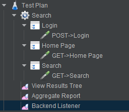

# JMeter InfluxDB listener plugin

## Description
The plugin sends metrics to InfluxDB and provide the possibility to visualize the charts in Grafana and have the Aggregate report as Jmeter creates. Added the possibly to save the following fields in the database:
* Response code;
* Error message;
* Response body of the failed requests (can be configured); 
* Connect time;
* Latency;
* The response time (uses from the SampleResult.class, needs to make aggregate report). 

## Compatibility
The supported versions:
* InfluxDB 1.8 or less.
* JMeter 5.3.

## Deployment
* Put 'jmeter-plugin-influxdb-listener-<version>.jar' file to ~<JmeterPath>\lib\ext;

  
* Run JMeter and select the test plan, Add-> Listener -> Backend Listener.

  
* Select from the dropdown item with the name 'org.md.jmeter.influxdb.visualizer.JMeterInfluxDBBackendListenerClient'.

  

## Plugin configuration 
Let’s explain the plugin fields:
* `testName` - the name of the test.
* `nodeName` - the name of the server.
* `runId` - the identification number of hte test run, can be dynamic.
* `influxDBHost` - the host name or ip of the InfluxDB server.
* `influxDBPort` - the port of the InfluxDB server, the default is 8086.
* `influxDBUser` - the InfluxDB user. 
* `influxDBPassword` - the InfluxDB user's password.
* `influxDBDatabase` - the InfluxDB database name.
* `retentionPolicy` - the InfluxDB database retention policy; the _autogen_ option allows to have no limitation. 
* `samplersList` - the regex value to sort out the JMeter samplers results; the default is _.*_. For example if you have the pattern of JMeter test plan development like this - create the 'Transaction controller', add inside of the 'Transaction controller' the Sampler with request with the name pattern 'GET->Something', see screen below.
   
   
   
   The regex to save the 'Transaction controller' names only is _^((?!->).)*$_ (not contain the _->_).
* `useRegexForSamplerList` - allows to use the regexps if set to 'true'.
* `recordSubSamples` - allows to save the JMeter sub samples if set to 'true'.
* `saveResponseBodyOfFailures` - allows to save the response body of the failures.